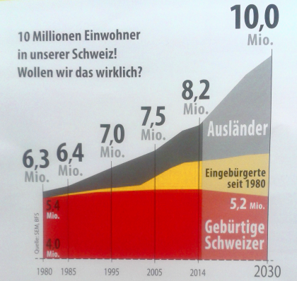
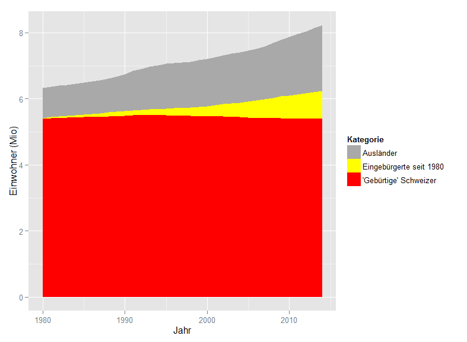

#chpop

J'ai reçu de la part de l'Union Démocratique du Centre (UDC) un flyer contenant le graphique à gauche. Le graphique à droite est réalisé par mes soins, après avoir téléchargé les données de l'Office Fédéral de la Statistique (http://www.bfs.admin.ch/). Comparaison intéressante...

 

(NB: mon graphique se limite à la période documentée, c'est-à-dire 1980-2014, sans projections à 2030. Le script R pour reproduire l'analyse se trouve [ici](popstat.r).)
